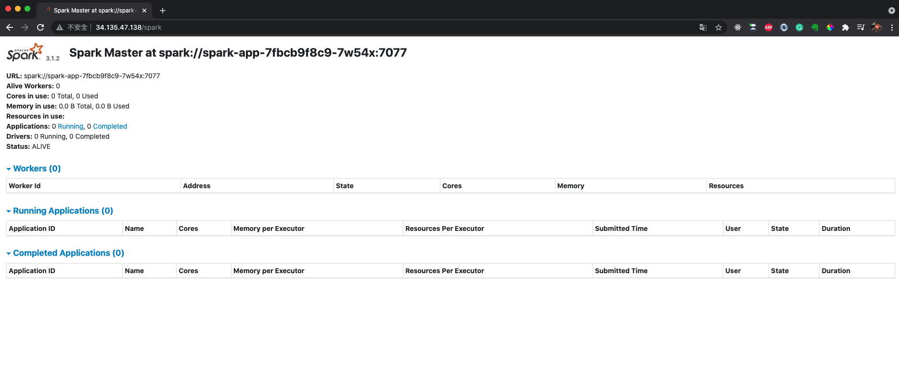
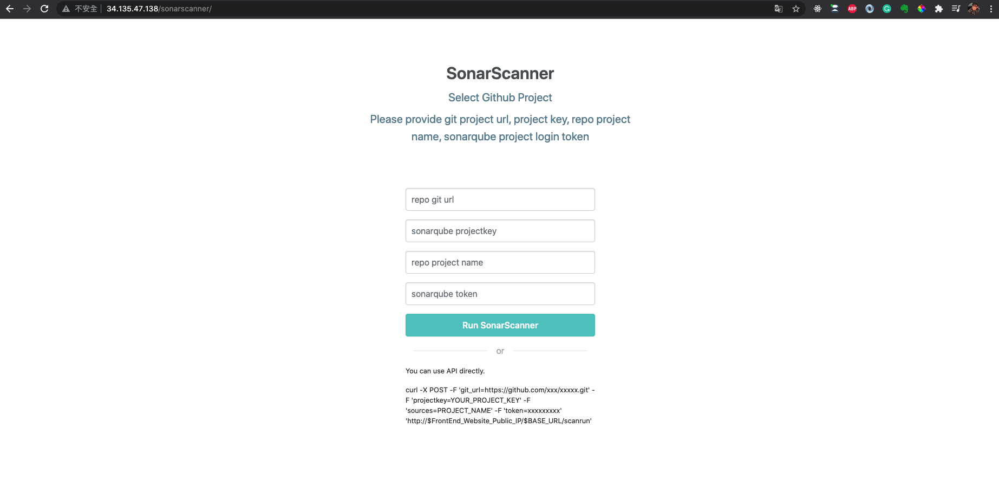

# 14848_cloud_infra_proj_driver

## How to build docker image
- Run `docker build --no-cache --progress=plain -t YOUR_DOCKER_ID/14848_proj_driver:ssh . ` and push the image to DockerHub.

## Deploy docker image to Google Cloud Platform Kubernetes Cluster
- Open Cloud Shell on GCP and clone the repository:
```
git clone https://github.com/shihsunl/14848_cloud_infra_proj_driver.git
```
- Modify docker image in `resource-manifests/main_driver_ssh_development.yaml`.
- Execute 2 yaml file in resource-manifests folder.
```
cd 14848_cloud_infra_proj_driver/resource-manifests/
kubectl apply -f main_driver_ssh_development.yaml
kubectl create -f service_main_driver_ssh-lb.yaml
```
- Then, you can check Workloads and Service & Ingress


- Now, Front-End Service is ready! You can open your browser and access the IP with port 80. For my example, according to the Service & Ingress page, I can use 34.135.47.138:80 to access Service website and select the service that you want.
- Before you select the service, make sure you deploy the service to Google Cloud Platform Kubernetes Cluster.
- Spark Service: `https://github.com/shihsunl/14848_cloud_infra_proj_spark`
- Jupyter Service: `https://github.com/shihsunl/14848_cloud_infra_proj_jupyter`
- Hadoop Service: `https://github.com/shihsunl/14848_cloud_infra_proj_hadoop`
- SonarQube and SonarScanner Service: `https://github.com/shihsunl/14848_cloud_infra_proj_sonarqube_sonarscanner`

- Service Website


- I've used Reverse Proxy to make different url paths redirect to different services. For instance, when you use `34.135.47.138/spark`, it will redirect to `http://spark-service` which is the spark service with port 8080. You can check `https://github.com/shihsunl/14848_cloud_infra_proj_spark/blob/master/resource-manifests/service-spark.yaml` for more detail.


- Hadoop Service

- Spark Service

- Jupyter Service

- SonarQube Service

- SonarScanner Demo Website
- Normally, we need to use commandline to execute SonarScanner. However, we can not allow user to access our server and use commandline. Therefore, I've created a RESTful API Server to let user use SonarScanner.
- How to use: 
    - First you need to create a project in SonarQube and get the token.
    - Then, choose a repository that you want to scan.
    - Input Git repo url, Repo project name, SonarQube Project Key, and SonarQube Project token
    - Or you can use API `http://{IP}/{BASE_URL}/scanrun` to trigger SonarScanner.
    - Example: 
    ```
    curl -X POST -F 'git_url=https://github.com/xxx/xxxxx.git' -F 'projectkey=YOUR_PROJECT_KEY' -F 'sources=PROJECT_NAME' -F 'token=xxxxxxxxx'  'http://{IP}/{BASE_URL}/scanrun'

    curl -X POST -F 'git_url=https://github.com/shihsunl/14848_Cloud_Infra_HW3.git' -F 'projectkey=test76' -F 'token=3e7c17d0634217c9946d3cb994d299bd1a22fb59' -F 'sources=14848_Cloud_Infra_HW3' 'http://34.135.47.138/sonarscanner/scanrun'
    ```
